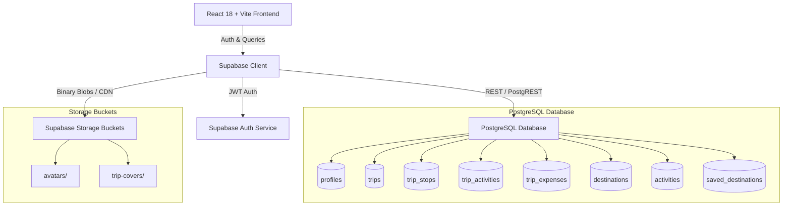
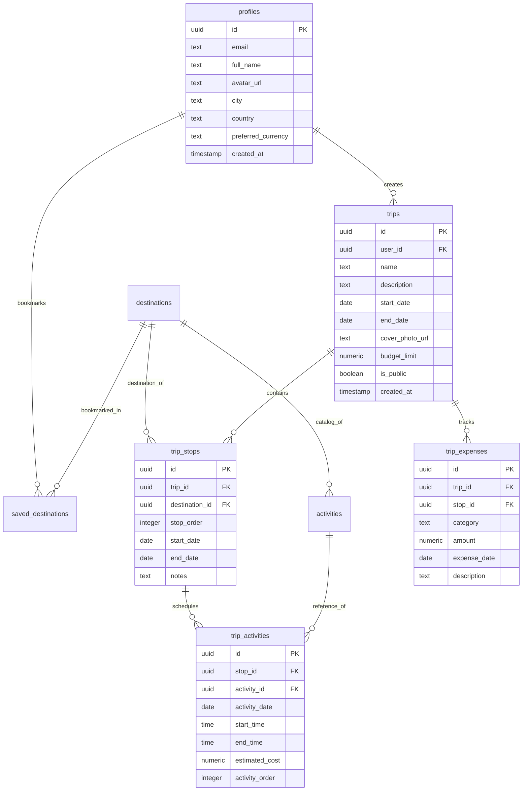

# GlobeTrotter — Empowering Personalized Travel Planning

> **Plan. Organize. Explore. Budget. Share.**  
> A full-stack, multi-city travel planning and itinerary management platform developed for the **Odoo Hackathon**.

---

## 🌟 Overview

**GlobeTrotter** is a modern, responsive web application engineered to transform how travelers create, customize, budget, visualize, and share complex multi-city journeys. 

Built with **React**, **TypeScript**, **Tailwind CSS**, and **Supabase (PostgreSQL, Auth, Storage)**, GlobeTrotter eliminates the chaos of fragmented travel planning by providing real-time itinerary re-sequencing, live budget analytics, interactive day-wise calendar schedules, curated destination discovery, and administrative management.

---

## 📋 Table of Contents

- [Features](#-features)
- [Screen & Route Matrix](#-screen--route-matrix)
- [Tech Stack](#-tech-stack)
- [Architecture](#-architecture)
- [Database Schema & Relationships](#-database-schema--relationships)
- [Authentication & Security](#-authentication--security)
- [Project Structure](#-project-structure)
- [Getting Started](#-getting-started)
- [Environment Variables](#-environment-variables)
- [Running Locally](#-running-locally)
- [Supabase Backend Setup](#-supabase-backend-setup)
- [Admin Access & Demo Credentials](#-admin-access--demo-credentials)
- [User Journeys](#-user-journeys)
- [Build & Verification](#-build--verification)
- [Contributors](#-contributors)
- [License](#-license)

---

## 🚀 Features

### 🔐 1. Authentication & Traveler Profiles
- **Unified Authentication**: Streamlined sign-up, sign-in, email verification, and password reset workflows.
- **Profile Customization**: Persistent avatar uploads with client-side image compression, bio management, home destination, and personal travel preferences stored directly in Supabase Storage and PostgreSQL.
- **Data Isolation**: Strict Row-Level Security (RLS) guarantees that private trips, itineraries, expenses, and bookmarks are isolated per user.

### ✈️ 2. Multi-City Trip Planning & Cover Customization
- **Trip Creation**: Set trip name, description, date ranges, and custom travel budget limits.
- **Custom Cover Photos**: User-uploaded cover images with automatic JPEG compression and persistent Supabase Storage integration (`trip-covers` bucket).
- **Trip Dashboard**: Dynamic overview displaying upcoming and active trips, recent destination bookings, and cost summaries.

### 🗺️ 3. Sequential Itinerary Builder
- **Continuous Timeline Logic**: Multi-city stops strictly enforce sequential dates — the departure of one stop feeds seamlessly into the arrival of the next stop without date gaps or overlaps.
- **Drag-and-Drop Reordering**: Intuitive re-ordering of trip stops via Framer Motion that automatically re-calculates dates across the entire itinerary in real time.
- **Stop & Experience Management**: Add notes, accommodations, and curated activities from the destination catalog.
- **Duplicate Prevention**: Immediate database validation prevents duplicate activities per stop.

### 🔍 4. Destination & Activity Discovery
- **City Search**: Global destination catalog filterable by region (Asia, Europe, Americas, Africa, Oceania) with live search and popularity rankings.
- **Activity Catalog**: Curated experiences per city with category filtering (Sightseeing, Adventure, Culture, Food & Drink, Nature), pricing, and estimated durations.
- **Saved Bookmarks**: Bookmark dream destinations to user accounts for one-click future trip additions.

### 💰 5. Live Budget Tracking & Expense Breakdown
- **Category Cost Breakdown**: Real-time spending distribution across Stay/Accommodation, Transport, Meals, Activities, and Miscellaneous.
- **Average Cost per Day**: Dynamic daily cost computation and comparison against target budget limits.
- **Overbudget Alerts**: Automatic detection and visual alerts for days that exceed target budget thresholds.
- **Expense Logging**: Log custom trip-wide or stop-specific expenses with customizable categories, amounts, and receipts.

### 📅 6. Interactive Day-Wise Calendar & Timeline
- **Calendar Grid**: Expandable and collapsible day-by-day itinerary cards displaying scheduled activities, start/end times, and travel transit days.
- **Activity Reordering**: Drag and drop activities within individual days to rearrange the daily schedule.
- **Quick Schedule Editor**: Modal for updating activity start/end times, custom costs, and booking confirmation notes.

### 🔗 7. Public Itinerary Sharing
- **Public / Private Visibility**: One-click toggle to make an itinerary public.
- **Shareable Links**: Clean public view (`/shared/:tripId`) accessible without login.
- **Copy Trip**: Authenticated travelers can duplicate any public itinerary directly into their personal dashboard.
- **Social Sharing**: One-click sharing to WhatsApp, Twitter, Facebook, or direct link copy.

### 🛡️ 8. Dedicated Admin Panel & Analytics
- **Manage Users**: View registered travelers, member join dates, locations, and inspect complete itineraries created by each user.
- **Popular Cities & Activities**: Real-time ranking of most planned destinations and experiences across all itineraries.
- **Platform Analytics & Trends**: Visual charts for total itineraries created, destination distribution, public vs. private ratio, and booking metrics.

---

## 📱 Screen & Route Matrix

| Route | Page Component | Access | Purpose |
| :--- | :--- | :--- | :--- |
| `/login` | `Login.tsx` | Public | Unified sign-in for travelers and demo administrator |
| `/signup` | `Signup.tsx` | Public | Traveler account registration with photo upload |
| `/verify-email` | `VerifyEmail.tsx` | Public | Email confirmation notice and status verifier |
| `/auth/callback` | `AuthCallback.tsx` | Public | Supabase OAuth and email verification callback handler |
| `/forgot-password` | `ForgotPassword.tsx` | Public | Request password recovery email |
| `/reset-password` | `ResetPassword.tsx` | Public | Set new account password |
| `/shared/:tripId` | `SharedItinerary.tsx` | Public | Read-only shareable itinerary view with "Copy Trip" |
| `/dashboard` | `Dashboard.tsx` | Traveler (Auth) | Traveler dashboard with trip highlights and recommendations |
| `/trips` | `MyTrips.tsx` | Traveler (Auth) | List, filter, and manage personal trips |
| `/trips/create` | `CreateTrip.tsx` | Traveler (Auth) | Plan a new journey with custom cover image & budget |
| `/itinerary/:tripId` | `ItineraryBuilder.tsx` | Traveler (Auth) | Sequential stop builder, re-sequencing, and activity picker |
| `/itinerary/:tripId/view` | `ItineraryView.tsx` | Traveler (Auth) | Full printable/preview itinerary breakdown |
| `/search/cities` | `CitySearch.tsx` | Traveler (Auth) | Explore global cities, search, and bookmark |
| `/search/activities` | `ActivitySearch.tsx` | Traveler (Auth) | Browse curated experiences, search, and filter |
| `/trip/:tripId/budget` | `TripBudget.tsx` | Traveler (Auth) | Live budget analytics, charts, overbudget alerts, expenses |
| `/trip/:tripId/calendar` | `TripCalendar.tsx` | Traveler (Auth) | Day-wise calendar view with activity drag reordering |
| `/profile` | `Profile.tsx` | Traveler (Auth) | Profile avatar, preferences, and account management |
| `/admin` | `AdminDashboard.tsx` | Admin Only | Platform KPI overview and quick metrics |
| `/admin/users` | `ManageUsers.tsx` | Admin Only | User inspection, trip counts, and route viewing |
| `/admin/cities` | `PopularCities.tsx` | Admin Only | Destination planning frequency and regional analytics |
| `/admin/activities` | `PopularActivities.tsx`| Admin Only | Activity popularity rankings and booking frequency |
| `/admin/analytics` | `UserTrends.tsx` | Admin Only | Comprehensive platform trends and distribution charts |

---

## 🛠️ Tech Stack

### Frontend
- **Framework**: React 18 with TypeScript
- **Bundler & Dev Server**: Vite 5
- **Routing**: React Router 7
- **Styling**: Tailwind CSS 3, Vanilla CSS Design System (`boarding-pass`, `ticket-mono`, `parchment` palette)
- **Animations & Drag Reorder**: Framer Motion
- **Icons**: Lucide React
- **Date Utilities**: Date-fns

### Backend & Database
- **BaaS**: Supabase
- **Database**: PostgreSQL 15
- **Authentication**: Supabase Auth (Email/Password, JWT Session Persistence)
- **Storage**: Supabase Storage (`avatars` and `trip-covers` buckets)
- **Security**: PostgreSQL Row-Level Security (RLS) Policies

---

## 🏗️ Architecture



---

## 🗄️ Database Schema & Relationships



---

## 🔒 Authentication & Security

1. **Row-Level Security (RLS)**:
   - Each traveler can only `SELECT`, `INSERT`, `UPDATE`, or `DELETE` their own trips, stops, activities, expenses, and bookmarks (`auth.uid() = user_id`).
   - Public trips (`is_public = true`) permit read-only access for anonymous viewers on `/shared/:tripId`.
2. **Storage Isolation**:
   - `avatars`: Public read, authenticated user write scoped to `${auth.uid()}/*`.
   - `trip-covers`: Public read, authenticated user write scoped to `${auth.uid()}/*`.
3. **No Service-Role Keys on Client**:
   - Only `SUPABASE_ANON_KEY` is bundled in the frontend. All privileges are enforced via PostgreSQL RLS policies.

---

## 📁 Project Structure

```text
GlobeTrotter/
├── frontend/                     # React + TypeScript + Vite Frontend
│   ├── public/                   # Static assets (favicon, logos)
│   ├── src/
│   │   ├── components/           # Modular UI and feature components
│   │   │   ├── admin/            # AdminLayout and AdminProtectedRoute
│   │   │   ├── auth/             # ProtectedRoute
│   │   │   ├── budget/           # BudgetChart, OverbudgetAlert
│   │   │   ├── itinerary/        # ActivityCard, FlightPathLine, StopCard
│   │   │   ├── layout/           # Navbar, Sidebar, Footer, PageContainer
│   │   │   ├── shared/           # ConfirmDialog, EmptyState, LoadingSkeleton, UserAvatar
│   │   │   ├── trips/            # TripCard, TripList
│   │   │   └── ui/               # Core primitives (button, badge, dialog, input, select, etc.)
│   │   ├── contexts/             # AuthContext, AdminAuthContext
│   │   ├── data/                 # Static country & city fallback catalog
│   │   ├── hooks/                # useToast, useMobile
│   │   ├── lib/                  # dateSequence, supabase client, utils
│   │   ├── pages/                # App views (Dashboard, ItineraryBuilder, TripBudget, etc.)
│   │   │   └── admin/            # ManageUsers, PopularCities, PopularActivities, UserTrends
│   │   ├── services/             # Supabase API services (tripService, itineraryService, etc.)
│   │   ├── types/                # TypeScript interfaces (trip, stop, activity, budget, user)
│   │   ├── App.tsx               # Main routing tree and route guards
│   │   ├── index.css             # Tailwind & design system styles
│   │   └── main.tsx              # Application entry point
│   ├── .env.example              # Frontend environment template
│   ├── eslint.config.js          # ESLint configuration
│   ├── package.json              # Frontend dependencies and scripts
│   ├── tailwind.config.js        # Custom palette & Tailwind configuration
│   ├── tsconfig.json             # TypeScript root config
│   └── vite.config.ts            # Vite build configuration
├── backend/                      # Backend documentation & migrations
│   ├── docs/                     # API documentation
│   ├── supabase/
│   │   ├── migrations/           # SQL schema migrations & seed scripts
│   │   ├── seed.sql              # Initial database seeds
│   │   └── seed_activities.json  # Comprehensive activity catalog seed
│   ├── .env.example              # Backend environment template
│   ├── test-connection.js        # Supabase Node connection tester
│   └── test-connection.ps1       # Supabase PowerShell connection tester
├── .env.example                  # Root environment template
├── .gitignore                    # Git ignore rules
└── README.md                     # Project documentation
```

---

## ⚡ Getting Started

### Prerequisites

- **Node.js**: v18.x or higher
- **npm**: v9.x or higher
- **Supabase Account**: (Cloud or Local CLI)

---

## 🔑 Environment Variables

### Frontend Setup (`frontend/.env`)

Create a `.env` file inside the `frontend/` directory based on `frontend/.env.example`:

```env
VITE_SUPABASE_URL=https://your-project-id.supabase.co
VITE_SUPABASE_ANON_KEY=your-supabase-anon-key-here
```

### Backend Setup (`backend/.env`)

Create a `.env` file inside the `backend/` directory based on `backend/.env.example`:

```env
SUPABASE_URL=https://your-project-id.supabase.co
SUPABASE_ANON_KEY=your-supabase-anon-key-here
```

---

## 💻 Running Locally

1. **Clone the repository**:
   ```bash
   git clone https://github.com/Mayur142-CODE/GlobeTrotter.git
   cd GlobeTrotter
   ```

2. **Install frontend dependencies**:
   ```bash
   cd frontend
   npm install
   ```

3. **Start the local development server**:
   ```bash
   npm run dev
   ```

4. Open your browser and navigate to `http://localhost:5173`.

---

## 🗄️ Supabase Backend Setup

1. **Create a Supabase Project** at [supabase.com](https://supabase.com).
2. **Apply Database Migrations**:
   Run the migration files in sequence via the Supabase SQL Editor:
   - `backend/supabase/migrations/20260822000001_create_globetrotter_schema.sql` (Tables & RLS)
   - `backend/supabase/migrations/20260822000002_rich_seed_and_constraints.sql` (Destinations & Constraints)
   - `backend/supabase/migrations/20260822000003_storage_avatars_bucket.sql` (Storage buckets & storage RLS)
   - `backend/supabase/migrations/20260822000004_admin_and_public_profiles.sql` (Admin security views)
3. **Verify Connection**:
   ```bash
   cd backend
   node test-connection.js
   ```

---

## 🛡️ Admin Access & Demo Credentials

For hackathon evaluation and administrative inspection, a dedicated demo administrator account is pre-configured on the common login screen (`/login`):

| Role | Email / Admin ID | Password | Access Level |
| :--- | :--- | :--- | :--- |
| **Demo Admin** | `admin@globaltrotter.com` | `admin#123` | Full Admin Panel (`/admin/*`) |
| **Traveler** | Any registered email | Your password | Personal Traveler Experience |

*Note: The demo admin account automatically routes to the Admin Dashboard upon sign-in.*

---

## 🔄 User Journeys

### Traveler Flow
```text
[ Sign Up / Login ] 
        ↓
  [ Dashboard ] ──→ [ Explore Destinations / Activities ]
        ↓
  [ Plan Trip ] (Set Dates, Budget & Upload Custom Cover Photo)
        ↓
[ Itinerary Builder ] ──→ Add Sequential Stops & Experiences
        ↓
[ View Calendar / Timeline ] ──→ Reorder Daily Schedule & Set Times
        ↓
[ Budget Breakdown ] ──→ Log Custom Expenses & Track Daily Limits
        ↓
[ Public Sharing ] ──→ Toggle Public Link & Share with Friends
```

### Admin Flow
```text
[ Login as Admin (admin@globaltrotter.com) ]
        ↓
[ Admin Dashboard ] (Platform Overview & Quick KPIs)
        ↓
[ Manage Users ] ──→ Inspect Registered Travelers & Itineraries
        ↓
[ Popular Destinations ] ──→ Analyze Regional Destination Frequency
        ↓
[ Popular Activities ] ──→ Analyze Experience Popularity
        ↓
[ Platform Analytics ] ──→ Review User Trends & Platform Growth
```

---

## 🧪 Build & Verification

Run these verification commands in the `frontend/` directory:

- **Type Check**:
  ```bash
  npm run typecheck
  ```
- **Lint Check**:
  ```bash
  npm run lint
  ```
- **Production Build**:
  ```bash
  npm run build
  ```
- **Preview Production Bundle**:
  ```bash
  npm run preview
  ```

---

## 👥 Contributors

Developed with ❤️ for the **Odoo Hackathon**:

- **Mayur Chavda** — Full-Stack Engineer & Supabase Architect
- **Mohit Baraiya** — Frontend Engineer & UI/UX Specialist

---

## 📄 License

This project was developed for the **Odoo Hackathon**. All rights reserved.
